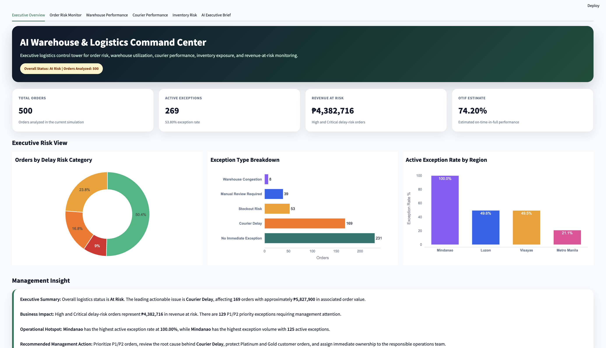
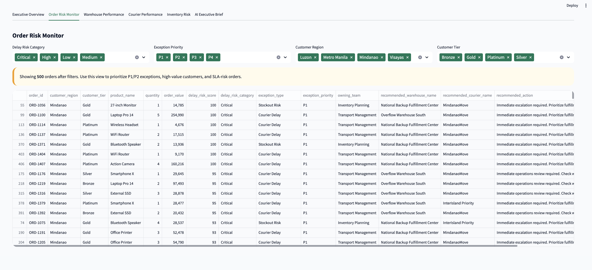
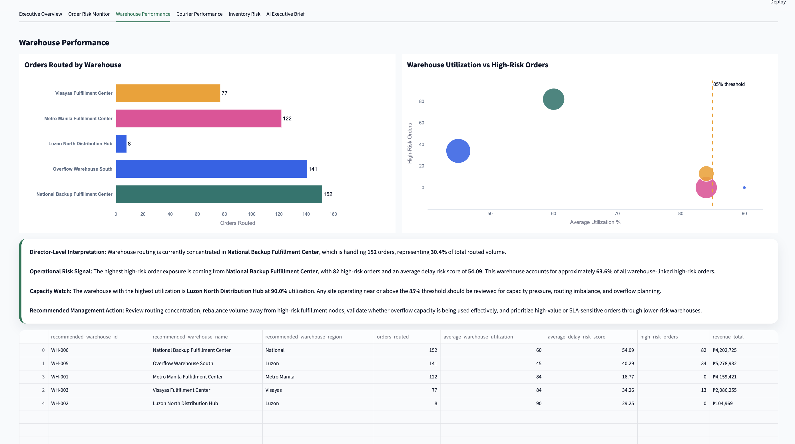
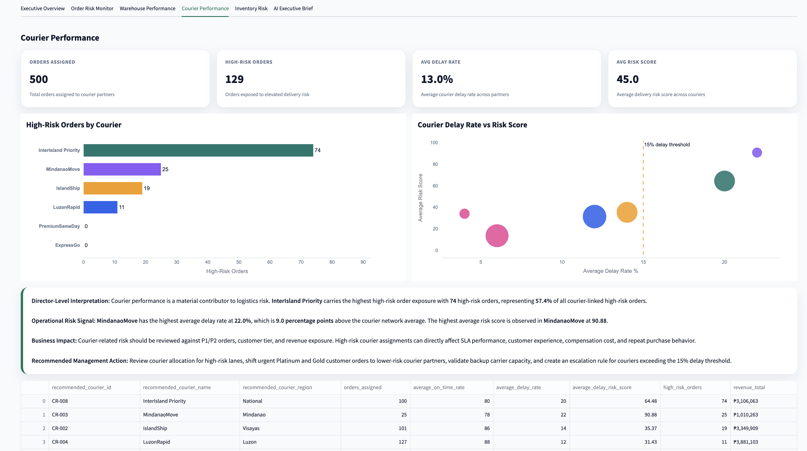
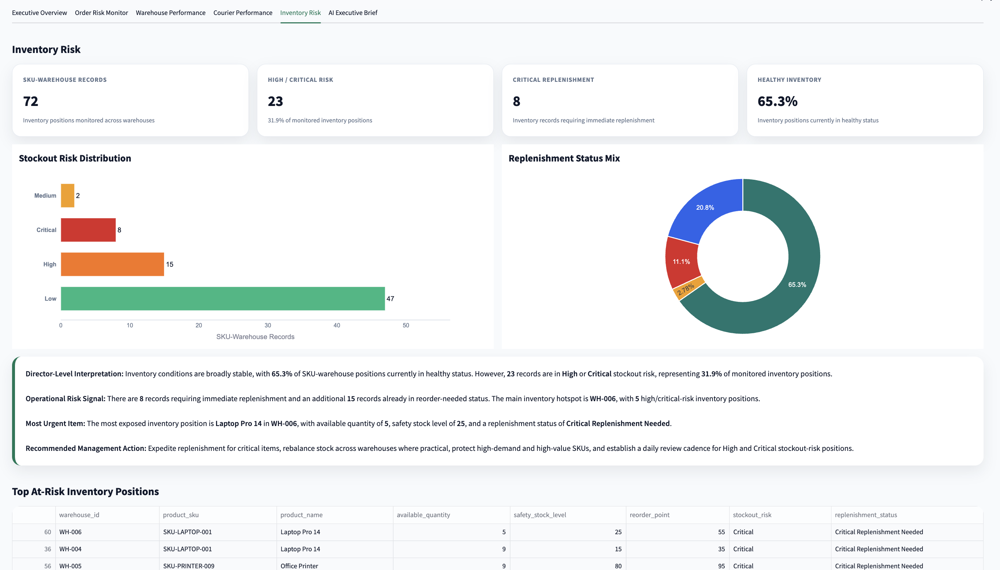
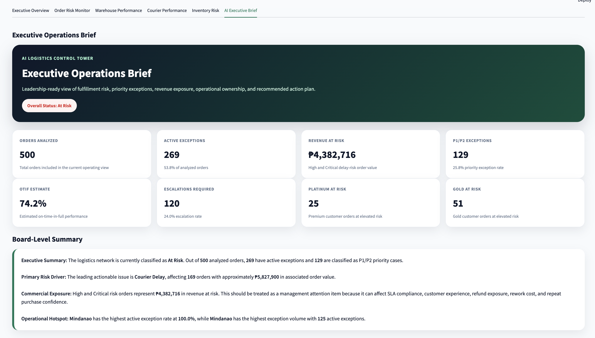

# AI Warehouse & Logistics Command Center

[](https://ai-logistics-command-center.streamlit.app)

## Live Dashboard

View the live dashboard here:

https://ai-logistics-command-center.streamlit.app

An executive-grade logistics intelligence system that simulates how an e-commerce company can monitor fulfillment risk, warehouse utilization, courier performance, inventory exposure, priority exceptions, and revenue at risk.

This portfolio project was designed for companies operating high-volume logistics environments such as Amazon-style fulfillment networks, Shopee, Lazada, courier operations, retail distribution, and supply chain control towers.

---

## Executive Summary

The **AI Warehouse & Logistics Command Center** analyzes 500 simulated e-commerce orders and automatically identifies operational risks across warehouse routing, courier performance, inventory availability, customer tier exposure, SLA pressure, and revenue-at-risk impact.

The system converts raw logistics data into management-ready insights:

* Which orders are likely to be delayed
* Which warehouse should fulfill each order
* Which courier should be assigned
* Which exceptions require escalation
* Which teams own the operational issue
* How much revenue is exposed
* Which regions, warehouses, and couriers are driving risk
* What leadership should do next

This project demonstrates how AI, automation, Python, FastAPI, and Streamlit can be used to create a logistics control tower for proactive exception management.

---

## Business Problem

E-commerce and logistics teams often operate reactively.

Common issues include:

* Late deliveries discovered too late
* Warehouse congestion not visible early enough
* Courier delay patterns not escalated quickly
* Inventory risks hidden across fulfillment locations
* High-value customer orders treated the same as low-risk orders
* Manual exception tracking across spreadsheets and emails
* Limited executive visibility into revenue at risk

The result is poor customer experience, missed SLAs, revenue leakage, avoidable escalations, and operational firefighting.

---

## Solution

This project creates a logistics intelligence layer that analyzes every order and produces:

* Warehouse recommendation
* Courier recommendation
* Inventory stockout risk
* Delay risk score
* Exception classification
* Priority level
* Owning team
* Recommended action
* Executive KPIs
* Dashboard-ready CSV and JSON outputs
* Streamlit management dashboard
* FastAPI endpoints for automation and integration

---

## Dashboard Preview

### Executive Overview



### Order Risk Monitor



### Warehouse Performance



### Courier Performance



### Inventory Risk



### AI Executive Brief



---

## Key Features

### 1. Mock Logistics Data Generator

The project includes a Python data generator that creates a realistic logistics dataset:

* 500 customer orders
* 500 delivery records
* 6 warehouses
* 8 courier partners
* 12 product SKUs
* 72 warehouse-SKU inventory records

Generated files:

```text
app/data/orders.csv
app/data/delivery_history.csv
app/data/warehouses.csv
app/data/couriers.csv
app/data/inventory.csv
```

---

### 2. Inventory Risk Engine

The inventory engine classifies SKU-warehouse inventory positions as:

* Low risk
* Medium risk
* High risk
* Critical risk

It also identifies replenishment status:

* Healthy
* Monitor Closely
* Reorder Needed
* Critical Replenishment Needed

This helps operations teams identify which items need immediate replenishment or closer monitoring.

---

### 3. Warehouse Selection Engine

The warehouse recommendation engine scores available fulfillment locations using:

* Customer region match
* Product availability
* Safety stock impact
* Warehouse utilization
* Daily load pressure
* Stockout risk

It recommends the best warehouse and explains the routing decision.

---

### 4. Courier Selection Engine

The courier recommendation engine scores courier partners using:

* Customer region coverage
* On-time rate
* Delay rate
* Average delivery days
* Cost per kilometer
* Delivery promise window

It recommends the best courier and explains the courier selection logic.

---

### 5. Delay Risk Prediction Engine

Each order receives a delay risk score and category:

* Low
* Medium
* High
* Critical

The score considers:

* Warehouse congestion
* Courier delay rate
* Courier risk level
* Warehouse selection risk
* Inventory risk
* Tight promised delivery windows
* Customer tier
* Regional routing mismatch

The output includes a recommended action for operations teams.

---

### 6. Exception Classification Engine

The exception classifier identifies the main operational issue behind each risky order.

Exception types include:

* Courier Delay
* Stockout Risk
* Warehouse Congestion
* SLA Breach Risk
* Inventory Shortage
* High Value Customer Risk
* Manual Review Required
* No Immediate Exception

Each exception is assigned:

* Priority level: P1, P2, P3, or P4
* Owning team
* Escalation requirement
* Recommended action

---

### 7. Executive KPI Engine

The KPI engine calculates leadership-level metrics such as:

* Total orders
* Active exceptions
* Active exception rate
* P1/P2 priority exceptions
* Revenue at risk
* Predicted delay rate
* OTIF estimate
* Perfect order rate estimate
* Escalation rate
* Platinum and Gold customer orders at risk
* Courier delay count
* Stockout risk count
* Warehouse congestion count

---

### 8. Export Engine

The export engine generates dashboard-ready output files:

```text
app/outputs/logistics_kpis.csv
app/outputs/order_risk_report.csv
app/outputs/exception_type_summary.csv
app/outputs/owning_team_summary.csv
app/outputs/warehouse_performance_summary.csv
app/outputs/courier_performance_summary.csv
app/outputs/region_summary.csv
app/outputs/executive_summary_input.json
```

These outputs can be used by:

* Streamlit
* n8n
* Claude
* Power BI
* Tableau
* Looker Studio
* Other reporting tools

---

### 9. FastAPI Backend

The project includes a FastAPI backend with endpoints for accessing logistics intelligence.

Important endpoints:

```text
GET /health
GET /orders
GET /warehouses
GET /inventory
GET /couriers
GET /delivery-history
GET /analyze/orders
GET /exceptions
GET /exceptions/priority
GET /kpis
GET /summaries/exception-types
GET /summaries/owning-teams
GET /summaries/warehouses
GET /summaries/couriers
GET /summaries/regions
GET /export
POST /order/analyze
```

The API can be used by automation tools such as n8n to trigger alerts, summaries, and workflow actions.

---

### 10. Streamlit Executive Dashboard

The Streamlit dashboard includes:

* Executive Overview
* Order Risk Monitor
* Warehouse Performance
* Courier Performance
* Inventory Risk
* AI Executive Brief

The dashboard is designed for management users and includes director-level interpretation, operational insights, and recommended action plans.

---

## Sample Executive KPIs

Based on the generated dataset, the system produced the following management signals:

```text
Total Orders: 500
Overall Status: At Risk
Active Exceptions: 269
P1/P2 Priority Exceptions: 129
Revenue at Risk: ₱4,382,716
OTIF Estimate: 74.20%
Predicted Delay Rate: 25.80%
Perfect Order Rate Estimate: 46.20%
```

Main risk signals:

```text
Leading actionable issue: Courier Delay
Affected courier delay orders: 169
Stockout risk records: 53
Warehouse congestion records: 8
Most exposed region: Mindanao
```

---

## Project Architecture

```text
Raw Logistics Data
        ↓
Data Loader
        ↓
Inventory Risk Engine
        ↓
Warehouse Selection Engine
        ↓
Courier Selection Engine
        ↓
Delay Risk Prediction Engine
        ↓
Exception Classification Engine
        ↓
Executive KPI Engine
        ↓
Export Engine
        ↓
FastAPI + Streamlit Dashboard + n8n/Claude-ready JSON
```

---

## Tech Stack

```text
Python
pandas
FastAPI
Uvicorn
Streamlit
Plotly
pytest
n8n-ready JSON outputs
Claude-ready executive summary input
```

---

## Folder Structure

```text
logistics-command-center/
├── app/
│   ├── data/
│   ├── models/
│   ├── outputs/
│   ├── services/
│   │   ├── data_loader.py
│   │   ├── inventory_service.py
│   │   ├── warehouse_selection_service.py
│   │   ├── courier_selection_service.py
│   │   ├── delay_prediction_service.py
│   │   ├── exception_classifier_service.py
│   │   ├── kpi_service.py
│   │   └── export_service.py
│   ├── config.py
│   └── main.py
├── dashboard/
│   └── streamlit_app.py
├── docs/
│   └── screenshots/
├── n8n/
├── scripts/
│   └── generate_mock_data.py
├── tests/
├── requirements.txt
├── README.md
└── .gitignore
```

---

## How to Run Locally

### 1. Clone the repository

```bash
git clone <your-repository-url>
cd logistics-command-center
```

### 2. Create a virtual environment

```bash
python3 -m venv .venv
source .venv/bin/activate
```

### 3. Install dependencies

```bash
pip install -r requirements.txt
```

### 4. Generate mock logistics data

```bash
python3 scripts/generate_mock_data.py
```

### 5. Run the export pipeline

```bash
python - <<'PY'
from app.services.data_loader import DataLoader
from app.services.export_service import run_full_export

loader = DataLoader()

result = run_full_export(
    loader.load_orders(),
    loader.load_warehouses(),
    loader.load_inventory(),
    loader.load_couriers()
)

print(result["message"])
PY
```

### 6. Run the FastAPI backend

```bash
uvicorn app.main:app --reload
```

Open:

```text
http://127.0.0.1:8000/docs
```

### 7. Run the Streamlit dashboard

In a separate terminal:

```bash
source .venv/bin/activate
streamlit run dashboard/streamlit_app.py
```

Open:

```text
http://localhost:8501
```

---

## Example API Request

### Analyze one order

Endpoint:

```text
POST /order/analyze
```

Sample payload:

```json
{
  "order_id": "ORD-9999",
  "customer_id": "CUST-9999",
  "customer_location": "Makati City",
  "customer_region": "Metro Manila",
  "product_sku": "SKU-CAMERA-006",
  "quantity": 1,
  "order_value": 39000,
  "customer_tier": "Platinum",
  "order_date": "2026-07-01",
  "promised_delivery_date": "2026-07-02"
}
```

The API returns warehouse recommendation, courier recommendation, delay risk score, exception type, priority level, owning team, and recommended action.

---

## Portfolio Value

This project demonstrates:

* Business process improvement thinking
* Logistics and operations analytics
* AI transformation project design
* Python data pipeline development
* FastAPI backend development
* Streamlit executive dashboard development
* Exception management logic
* KPI and revenue-at-risk storytelling
* n8n/Claude-ready automation architecture

It is designed to show how automation and AI can move a logistics team from reactive firefighting to proactive exception management.

---

## Future Enhancements

Planned improvements:

* n8n workflow for P1/P2 exception alerts
* Claude-generated executive brief
* Email or Slack notification automation
* Machine learning delay prediction model
* Scenario simulation for courier rerouting
* Inventory replenishment recommendation engine
* User authentication
* Live database integration
* Cloud deployment

---

## Author

Built as a portfolio project demonstrating AI, automation, logistics analytics, process improvement, and executive dashboarding capability.
